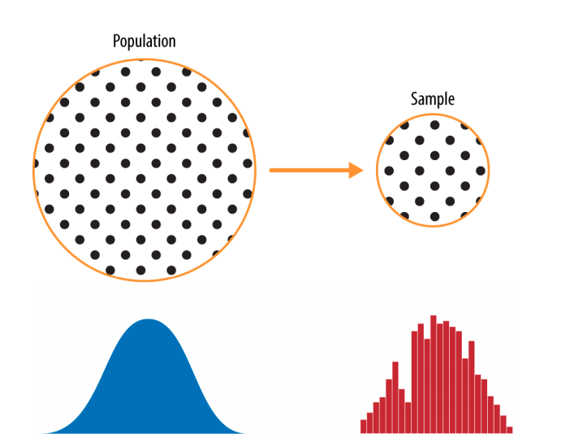
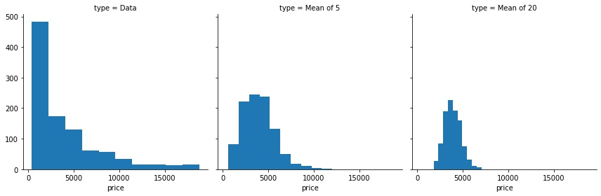

# 2 - Data and Sampling Distributions

## 2.1 - Random Sampling

### 2.1.2 - Key Terms for Random Sampling

|                                               |
|-----------------------------------------------|
|**Sample**: A subset from a larger data set.|
|**Population** : The larger data set or idea of a data set.|
|**N (n)** : The size of the population (sample).|
|**Random sampling** : Drawing elements into a sample at random.|
|**Stratified sampling** : Dividing the population into strata and randomly sampling from each strata.|
|**Stratum (pl., strata)** : A homogeneous subgroup of a population with common characteristics.|
|**Simple random sample**: The sample that results from random sampling without stratifying the population.|
|**Bias** :S ystematic error.|
|**Sample bias** : A sample that misrepresents the population.|

- A popular misconception holds that the era of big data means the end of a need for sampling.

- The proliferation of data of varying quality and relevance reinforces the need for sampling as a tool to work efficiently with a variety of data and to minimize bias.

- Traditional statistics focused very much on the lefthand side, using theory based on strong assumptions about the population. Modern statistics has moved to the righthand side, where such assumptions are not needed.

- A `sample` , is a subset of data from a larger data set; statisticians call this larger data set the `population`.

- Data quality often matters more than data quantity when making an estimate or a model based on a sample. Data quality in data science involves `completeness`, `consistency` of format, `cleanliness`, and `accuracy` of individual data points. Statistics adds the notion of `representativeness`.

### 2.1.3 - Bias

- Statistical `bias` refers to measurement or sampling errors that are systematic and produced by the measurement or sampling process.

- An important distinction should be made between errors due to random chance and errors due to bias.

- It is often an indicator that a statistical or machine learning model has been misspecified, or an important variable left out.

### 2.1.4 - Random Selection

- There are now a variety of methods to achieve representativeness, but at the heart of all of them lies `random sampling`.

- Stratified sampling, the population is divided up into strata, and random samples are taken from each stratum. 

### 2.1.5 - Size of Data

- In the era of big data, it is sometimes surprising that smaller is better. Time and effort spent on random sampling not only reduces bias but also allows greater attention to data exploration and data quality. For example, missing data and outliers may contain useful information. It might be prohibitively expensive to track down missing values or evaluate outliers in millions of records, but doing so in a sample of several thousand records may be feasible. Data plotting and manual inspection bog down if there is too much data.

### 2.1.6 - Further Reading

- A useful review of sampling procedures can be found in Ronald Fricker’s chapter “Sampling Methods for Online Surveys” in The SAGE Handbook of Online Research Methods, 2nd ed., edited by Nigel G. Fielding, Raymond M. Lee, and Grant Blank (SAGE Publications, 2016). This chapter includes a review of the modifications to random sampling that are often used for practical reasons of cost or feasibility.

## 2.2 - Sampling Distribution of a Statistic

- We will calculate our estimate or model using as much data as is easily available, so the option of drawing additional samples from the population is not readily available.

- It is important to distinguish between the distribution of the individual data points, known as the data distribution, and the distribution of a sample statistic, known as the sampling distribution.

- The distribution of a sample statistic such as the mean is likely to be more regular and bell-shaped than the distribution of the data itself.

### 2.2.1 Central Limit Theorem

- It says that the means drawn from multiple samples will resemble the familiar bell-shaped normal curve.

- The central limit theorem allows normal-approximation formulas like the t-distribution to be used in calculating sampling distributions for inference.(hypothesis test)

- The central limit theorem is not so central in the practice of data science.

### Key Ideas

- The frequency distribution of a sample statistic tells us how that metric would turn out differently from sample to sample.

- This sampling distribution can be estimated via the bootstrap, or via formulas that rely on the central limit theorem.

- A key metric that sums up the variability of a sample statistic is its standard error.

## 2.3 The Boostrap
- It is to draw additional samples, with replacement, from the sample itself and recalculate the statistic or model for each resample.

- It does not necessarily involve any assumptions about the data or the sample statistic being normally distributed.

1. Draw a sample value, record it, and then replace it.
2. Repeat n times.
3. Record the mean of the n resampled values.
4. Repeat steps 1–3 R times.
5. Use the R results to:
    a. Calculate their standard deviation (this estimates sample mean standard error).
    b. Produce a histogram or boxplot.
    c. Find a confidence interval.
    
|                                               |
|-----------------------------------------------|
|**Bootstrap sample**: A sample taken with replacement from an observed data set.|
|**Resampling**:The process of taking repeated samples from observed data; includes both boot‐
strap and permutation (shuffling) procedures.|

- The bootstrap does not compensate for a small sample size; it does not create new data, nor does it fill in holes in an existing data set. It merely informs us about how lots of additional samples would behave when drawn from a population like our original sample.

### Key Ideas

- The bootstrap (sampling with replacement from a data set) is a powerful tool for assessing the variability of a sample statistic.

- The bootstrap can be applied in similar fashion in a wide variety of circumstances, without extensive study of mathematical approximations to sampling distributions.

- It also allows us to estimate sampling distributions for statistics where no mathematical approximation has been developed.

- When applied to predictive models, aggregating multiple bootstrap sample predictions (bagging) outperforms the use of a single model.

## 2.4 Confidence Intervals

- Presenting an estimate not as a single number but as a range is one way to counteract this tendency. Confidence intervals do this in a manner grounded in statistical sampling principles.

- For a data scientist, a confidence interval is a tool that can be used to get an idea of how variable a sample result might be. Data scientists would use this information not to publish a scholarly paper or submit a result to a regulatory agency (as a researcher might) but most likely to communicate the potential error in an estimate, and perhaps to learn whether a larger sample is needed.

### Key ideas

- Confidence intervals are the typical way to present estimates as an interval range.
- The more data you have, the less variable a sample estimate will be.
- The lower the level of confidence you can tolerate, the narrower the confidence interval will be.
- The bootstrap is an effective way to construct confidence intervals.